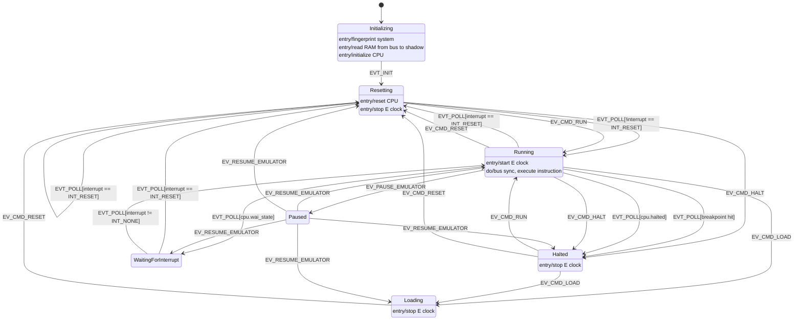

# Events

## USB commands

- run
- halt
- reset
- clear counts
- load
- resume from breakpoint
- `cpu.pc` set

## Runtime events

- Power-on
- `/RESET` asserted
- `/RESET` released
- `/IRQ` edge
- `/NMI` edge
- Breakpoint hit
- bad opcode
- `WAI` instruction

## Global State

- eclock running
- instructions executing
  - halted: no instructions
- held in reset
- in `WAI` state
- loading new program
- 5V lost: `/IRQ`, `/NMI`, `/RESET` all asserted

## Global Counters

- instruction count (from instruction execution)
- simulated cycle count (from instruction execution)
- Eclock count (from PIO)
- over/under cycles (from instruction execution)
- Per-instruction count and cycles (can be turned off)

## NOTES

- WAI instruction shortens IRQ response to 4 cycles
  - load vector (2 cycles)
- IRQ response is nornally 12 cycles
- WAI takes 9 cycles (stacks PC, X, A, B, CCR)

-------

