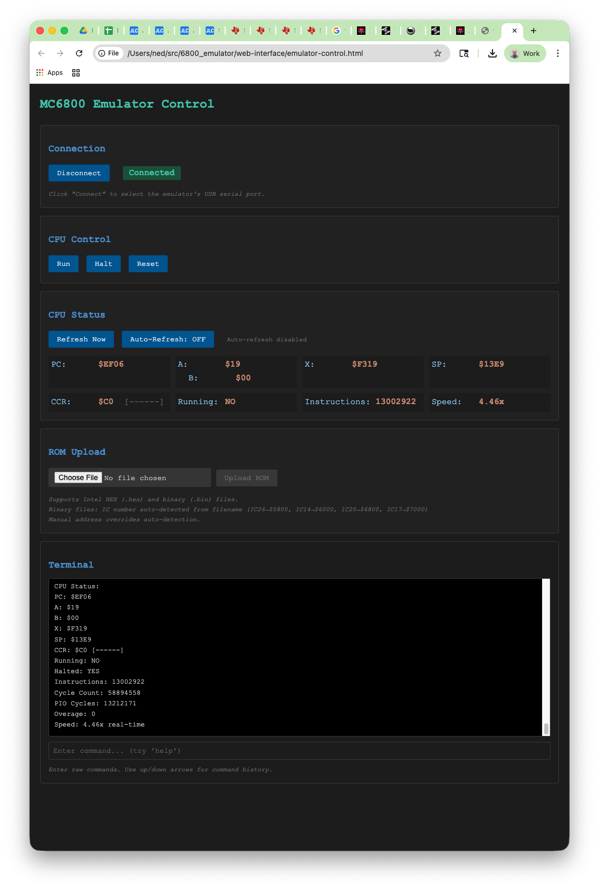

<!--
SPDX-License-Identifier: MIT

Copyright 2026 Ned Konz <ned@metamagix.tech>

Permission is hereby granted, free of charge, to any person obtaining a copy
of this software and associated documentation files (the "Software"), to deal
in the Software without restriction, including without limitation the rights
to use, copy, modify, merge, publish, distribute, sublicense, and/or sell
copies of the Software, and to permit persons to whom the Software is
furnished to do so, subject to the following conditions:

The above copyright notice and this permission notice shall be included in all
copies or substantial portions of the Software.

THE SOFTWARE IS PROVIDED "AS IS", WITHOUT WARRANTY OF ANY KIND, EXPRESS OR
IMPLIED, INCLUDING BUT NOT LIMITED TO THE WARRANTIES OF MERCHANTABILITY,
FITNESS FOR A PARTICULAR PURPOSE AND NONINFRINGEMENT. IN NO EVENT SHALL THE
AUTHORS OR COPYRIGHT HOLDERS BE LIABLE FOR ANY CLAIM, DAMAGES OR OTHER
LIABILITY, WHETHER IN AN ACTION OF CONTRACT, TORT OR OTHERWISE, ARISING FROM,
OUT OF OR IN CONNECTION WITH THE SOFTWARE OR THE USE OR OTHER DEALINGS IN THE
SOFTWARE.
-->

# Web Interface

## Overview

The MC6800 Emulator includes a browser-based control interface that provides a graphical alternative to the command-line USB interface. This single-file HTML application runs entirely in your browser and communicates with the emulator over USB using the WebSerial API.



**Key Features**:

- No installation required - single HTML file
- Real-time CPU status monitoring with auto-refresh
- One-click CPU control (Run, Halt, Reset)
- ROM loading from Intel HEX or binary files
- Automatic IC number detection for System 7 boards
- Built-in terminal for advanced commands
- Works entirely offline - no internet connection needed

## Browser Support

### ✅ Supported Browsers

- **Google Chrome** 89+
- **Microsoft Edge** 89+
- **Opera** 75+

### ❌ Not Supported

- **Firefox** - No WebSerial API support
- **Safari** - No WebSerial API support

**Note**: WebSerial API is a Chromium-only feature required for USB communication.

## Requirements

1. **Supported browser** (Chrome, Edge, or Opera)
2. **MC6800 emulator** connected via USB
3. **HTTPS or localhost** - WebSerial requires secure context:
   - File opened from `file://` (local file)
   - Served from `http://localhost`
   - Served from `https://` domain

## Getting Started

### Opening the Interface

**Option A: Local File**

Simply open the HTML file directly in your browser:

```bash
# macOS
open web-interface/emulator-control.html

# Linux
xdg-open web-interface/emulator-control.html

# Windows
start web-interface\emulator-control.html
```

**Option B: Local Web Server**

For development or if local files don't work:

```bash
cd web-interface
python3 -m http.server 8000

# Then open: http://localhost:8000/emulator-control.html
```

### First Connection

1. Click **"Connect to Emulator"** button
2. Browser shows device selection dialog
3. Select the emulator's USB serial port (e.g., "USB Serial Device")
4. Connection indicator turns green: **"Connected"**

**Troubleshooting Connection**:

- If no device appears, check USB cable connection
- Verify emulator firmware is running (LED should be lit)
- Try reconnecting USB cable
- Check browser console (F12) for errors

## Interface Sections

### 1. Connection Panel

Controls the WebSerial connection to the emulator.

**Buttons**:

- **Connect to Emulator** - Opens browser's serial port picker
- **Disconnect** - Closes the connection (appears after connecting)

**Status Indicator**:

- **Connected** (green) - Active USB connection
- **Disconnected** (red) - No connection

**Usage**:

```
1. Click "Connect to Emulator"
2. Select emulator from browser dialog
3. Status changes to "Connected"
4. All controls become active
```

### 2. CPU Control Panel

Direct control over CPU execution.

**Buttons**:

- **Run** - Start CPU execution from current PC
- **Halt** - Stop CPU execution
- **Reset** - Reset CPU to initial state

**Equivalent USB Commands**:

```
Run   → run
Halt  → halt
Reset → reset
```

**Typical Workflow**:

```
1. Load ROM file
2. Click "Reset" to initialize CPU
3. Click "Run" to start execution
4. Click "Halt" to pause and inspect state
```

### 3. CPU Status Panel

Real-time display of CPU state with configurable auto-refresh.

**Status Display**:

- **PC** - Program Counter (16-bit address)
- **A, B** - Accumulators (8-bit registers)
- **X** - Index Register (16-bit)
- **SP** - Stack Pointer (16-bit)
- **CCR** - Condition Code Register (8-bit) with flags `[HINZVC]`
- **Running** - YES/NO execution state
- **Instructions** - Total instructions executed
- **Speed** - Execution speed vs real-time (e.g., "4.46x")

**Auto-Refresh Controls**:

- **Refresh Now** - Manual status update (instant)
- **Auto-Refresh: ON/OFF** - Toggle automatic updates

**Auto-Refresh Behavior**:

- When **ON** and CPU is **running**: Updates every 1 second
- When **ON** and CPU is **halted**: Pauses automatically (no updates)
- When **OFF**: Only manual "Refresh Now" updates

**Status Indicator Messages**:

- "Updates every 1s when running" - Auto-refresh active, waiting for execution
- "Paused (CPU halted)" - Auto-refresh on but CPU stopped
- "Auto-refresh disabled" - Manual refresh only
- "Not connected" - No USB connection

**Example Display**:

```
PC: $8EF06        A: $19         X: $F319       SP: $13E9
                  B: $00

CCR: $C0 [------]  Running: NO   Instructions: 13002922   Speed: 4.46x
```

**CCR Flags**:

- **H** - Half-carry
- **I** - Interrupt mask
- **N** - Negative
- **Z** - Zero
- **V** - Overflow
- **C** - Carry

### 4. ROM Upload Panel

Load programs into the emulator's ROM

**File Format Support**:

- **Intel HEX** (`.hex`) - Standard format, address included in file
- **Binary** (`.bin`) - Raw bytes, requires start address

**Upload Process**:

**For Intel HEX Files**:

```
1. Click "Choose File"
2. Select .hex file
3. Click "Upload ROM"
4. Wait for "Upload successful!" message
```

**For Binary Files**:

```
1. Click "Choose File"
2. Select .bin file
3. Address input appears:
   - IC number auto-detected (if in filename)
   - Pre-filled with detected address
   - Or enter address manually (hex, without $)
4. Click "Upload ROM"
5. File is converted to Intel HEX automatically
6. Wait for success message
```

**System 7 IC Number Detection**:

Binary files with IC numbers in the filename are automatically mapped:

| Filename Pattern | IC Number | Start Address | ROM Size |
|-----------------|-----------|---------------|----------|
| `IC26.bin` | IC26 | $5800 | 2KB |
| `IC14.bin` | IC14 | $6000 | 2KB |
| `IC20.bin` | IC20 | $6800 | 2KB |
| `IC17.bin` | IC17 | $7000 | 2KB |

**Examples**:

```
game_IC26.bin         → Auto-detects $5800
sys7_IC20_v2.bin      → Auto-detects $6800
custom_rom.bin        → Manual address entry required
```

**Manual Address Entry**:

For binary files without IC numbers:

- Enter address in hexadecimal (4 digits)
- No `$` prefix needed
- Example: `5000` for address $5000
- Address is editable even when auto-detected

**Upload Status Messages**:

- "Uploading..." - Transfer in progress
- "Upload successful!" - ROM loaded and verified
- "Upload error: ..." - See error message for details

**Behind the Scenes**:

Binary files are automatically converted to Intel HEX format before upload:

1. File read as binary data
2. Split into 16-byte records
3. Intel HEX records generated with checksums
4. EOF record added
5. Sent via USB `load` command
6. Emulator processes and verifies

### 5. ROM Download Panel

Download (backup) memory contents from the emulator to your computer as Intel HEX files.

**Controls**:

- **Address (hex)** - Starting address in hexadecimal (e.g., 5000)
- **Length (hex)** - Number of bytes to download in hexadecimal (e.g., 3000)
- **Download Memory** - Perform the download and save to file

**Quick Presets**:

- **ROM (5000:3000)** - Download 12KB ROM region
- **RAM (0000:1400)** - Download 5KB RAM region
- **Vectors (FFF8:8)** - Download reset/interrupt vectors

**Download Process**:

```
1. Enter address and length (or use a preset button)
2. Click "Download Memory"
3. Browser saves file as memory_ADDR_LEN.hex
4. File is in standard Intel HEX format
```

**Equivalent USB Command**:

```
download 5000 3000
```

**Output File Format**:

- Standard Intel HEX format
- 16 bytes per record
- Proper checksums
- EOF record included
- Compatible with assemblers and EPROM programmers

**Example Output Files**:

- `memory_5000_3000.hex` - ROM from $5000, 12KB
- `memory_0000_1400.hex` - RAM from $0000, 5KB
- `memory_0100_0100.hex` - CMOS from $0100, 256B

**Use Cases**:

- **Backup ROM** before loading new code
- **Extract code** for analysis or archival
- **Verify uploads** by downloading and comparing
- **Create snapshots** for version control

**Status Messages**:

- "Downloading memory..." - Download in progress
- "Downloaded N bytes to filename.hex" - Success
- "Download failed: error" - Error occurred

**Notes**:

- Files are saved directly to your browser's download folder
- Address and length must be valid hexadecimal (no $ prefix)
- Maximum download size: 64KB (full address space)
- Download works with ROM, RAM and unmapped regions
- Unmapped regions access physical bus (E clock auto-started)

**Example Workflow - Backup Before Update**:

```
1. Click "ROM (5000:3000)" preset
2. Click "Download Memory"
3. File saved: memory_5000_3000.hex
4. Upload new ROM
5. Test new ROM
6. If problems, re-upload the backup file
```

### 6. Terminal Panel

Full command-line access for advanced operations.

**Features**:

- **Command Input** - Type any USB command
- **Command History** - Use ↑/↓ arrow keys to navigate
- **Auto-scroll** - Terminal scrolls to latest output
- **Real-time Output** - All emulator responses shown

**Available Commands**:

All USB CDC commands are supported. See [USB Commands](USB-Commands.md) for complete reference.

**Common Commands**:

```bash
help              # Show command list
status            # Display CPU status (same as panel)
config            # Show memory configuration
read 5000 20      # Read 32 bytes from $5000
write 0100 AA 55  # Write bytes to memory
debug on/off      # Enable/disable SPI debug output
cycletest         # Run cycle count test
```

**Terminal Usage**:

```
1. Type command in input box
2. Press Enter to send
3. Output appears in terminal
4. Use ↑/↓ for command history
5. Recent output appears above older output
```

**Tips**:

- Terminal shows ALL emulator output, including:
  - Command responses
  - ROM upload progress
  - Status updates (when auto-refresh enabled)
  - Error messages
- Disable auto-refresh when using terminal extensively
- Use "Refresh Now" for status checks without flooding terminal

## Usage Examples

### Example 1: Load and Run Program

**Intel HEX File**:

```
1. Connect to emulator
2. ROM Upload → Choose File → Select program.hex
3. Click "Upload ROM"
4. Wait for "Upload successful!"
5. Click "Reset"
6. Click "Run"
7. Watch status panel for execution
```

**Binary File (with IC number)**:

NOTE: this only works for system 7 games right now.

```
1. Connect to emulator
2. ROM Upload → Choose File → Select game_IC26.bin
3. Address auto-fills with "5800" (IC26 detected)
4. Click "Upload ROM"
5. Wait for success message
6. Click "Reset"
7. Click "Run"
```

**Binary File (manual address)**:

```
1. Connect to emulator
2. ROM Upload → Choose File → Select custom.bin
3. Enter start address: "E000"
4. Click "Upload ROM"
5. Wait for success
6. Click "Reset"
7. Click "Run"
```

### Example 2: Debug Running Program

```
1. Program is running (Running: YES in status)
2. Watch Instructions count increase
3. Check Speed indicator (should be ~1.0x or higher)
4. Click "Halt" to stop
5. Inspect registers in status panel
6. Use terminal: "read 0100 20" to check memory
7. Click "Run" to resume
```

### Example 3: Monitor Execution

```
1. Load and start program
2. Enable "Auto-Refresh: ON"
3. Watch status panel update every 1 second:
   - PC advances
   - Instructions count increases
   - Speed reported
4. When debugging:
   - Click "Halt" (auto-refresh pauses)
   - Inspect state in status panel
   - Use terminal for detailed memory inspection
5. Click "Run" (auto-refresh resumes)
```

### Example 4: Download ROM for Backup

```
1. Connect to emulator
2. ROM Download → Click "ROM (5000:3000)" preset
3. Click "Download Memory"
4. Browser saves file: memory_5000_3000.hex
5. File contains backup of 12KB ROM
```

**Or download manually**:

```
1. ROM Download → Enter address: "5000"
2. Enter length: "3000"
3. Click "Download Memory"
4. memory_5000_3000.hex saved to Downloads
```

### Example 5: Development Cycle with Backup

```
1. Click "ROM (4000:C000)" preset
2. Click "Download Memory" → Saves backup
3. ROM Upload → Load new code
4. Click "Reset" → Click "Run"
5. Test the new code
6. If problems: ROM Upload → Load backup file
7. Click "Reset" → Click "Run" → Back to working state
```

### Example 7: System 7 Multi-ROM Load

```
1. Load IC26.bin → Auto-detected at $5800
2. Load IC14.bin → Auto-detected at $6000
3. Load IC20.bin → Auto-detected at $6800
4. Load IC17.bin → Auto-detected at $7000
5. All ROMs now in place
6. Click "Reset"
7. Click "Run"
8. System 7 game should start
```

## Technical Details

### WebSerial Communication

The interface uses the browser's WebSerial API to communicate directly with the emulator's USB CDC interface:

**Connection Flow**:

```
1. User clicks "Connect to Emulator"
2. Browser shows navigator.serial.requestPort()
3. User selects emulator from list
4. port.open({ baudRate: 115200 })
5. Connection established
6. Read/write loops start
```

**Command Protocol**:

- Commands sent as text with `\r\n` termination
- Responses parsed line-by-line
- Multi-line responses (status, read, dump) accumulated
- Timeouts prevent hanging on errors

**Data Flow**:

```
JavaScript                    Emulator
    |                            |
    |-- "status\r\n" ----------->|
    |                            |
    |<-- "CPU Status:\r\n" ------|
    |<-- "  PC: $5000\r\n" ------|
    |<-- "  A:  $42\r\n" --------|
    |<-- "...\r\n" --------------|
    |                            |
    |-- "run\r\n" -------------->|
    |<-- "OK: CPU started\r\n" --|
```

### Binary to Intel HEX Conversion

Binary files are converted in the browser before upload:

**Conversion Algorithm**:

```javascript
1. Read binary file as ArrayBuffer
2. Convert to Uint8Array
3. Split into 16-byte chunks
4. For each chunk:
   a. Create data record
   b. Calculate address (base + offset)
   c. Generate checksum (two's complement)
   d. Format as :LLAAAATTDD...CC
5. Append EOF record :00000001FF
6. Join with \r\n line endings
7. Send via "load" command
```

**Intel HEX Record Format**:

```
:LLAAAATTDD...CC
 ||||||  |     |
 ||||||  |     +-- Checksum (1 byte)
 ||||||  +-------- Data bytes (LL bytes)
 ||||++----------- Record type (00=data, 01=EOF)
 ||++------------- Address (2 bytes, big-endian)
 ++--------------- Byte count (1 byte)
```

**Example Record**:

```
:10580000AABBCCDD...checksum
 10      - 16 bytes of data
   5800  - Start address $5800
       00 - Data record type
         AABB... - Data bytes
                checksum - Two's complement
```

### Status Parsing

Status updates are parsed from the emulator's `status` command output:

**Parse Strategy**:

```javascript
1. Send "status" command
2. Accumulate response lines in buffer
3. Use regex to extract fields:
   - PC:  /PC:\s*\$([0-9A-F]{4})/i
   - A:   /A:\s*\$([0-9A-F]{2})/i
   - B:   /B:\s*\$([0-9A-F]{2})/i
   - X:   /X:\s*\$([0-9A-F]{4})/i
   - SP:  /SP:\s*\$([0-9A-F]{4})/i
   - CCR: /CCR:\s*\$([0-9A-F]{2})\s*\[([^\]]+)\]/i
   - Running: /Running:\s*(YES|NO)/i
   - Instructions: /Instructions:\s*(\d+)/
   - Speed: /Speed:\s*([\d.]+)x/
4. Update UI elements with extracted values
```

### File Structure

The interface is a single self-contained HTML file:

```
emulator-control.html (1093 lines)
├── HTML Structure (80 lines)
│   ├── Connection Panel
│   ├── CPU Control Panel
│   ├── CPU Status Panel
│   ├── ROM Upload Panel
│   └── Terminal Panel
├── CSS Styling (150 lines)
│   ├── Dark theme
│   ├── Layout
│   └── Responsive design
└── JavaScript (860 lines)
    ├── EmulatorConnection class (200 lines)
    │   ├── WebSerial connection management
    │   ├── Command sending
    │   ├── Response reading
    │   └── Disconnect handling
    ├── ROMLoader class (200 lines)
    │   ├── File reading
    │   ├── Format detection
    │   ├── IC number detection
    │   ├── Binary to HEX conversion
    │   └── HEX uploading
    ├── StatusParser class (100 lines)
    │   ├── Regex-based parsing
    │   └── Field extraction
    └── UI class (360 lines)
        ├── Event handlers
        ├── Status refresh
        ├── Terminal management
        └── UI updates
```

## Troubleshooting

### Connection Issues

**"WebSerial API not supported"**

- Use Chrome, Edge, or Opera (latest version)
- Firefox and Safari don't support WebSerial
- Update browser to latest version

**"User cancelled the requestDevice() chooser"**

- You clicked "Cancel" in the device picker
- Click "Connect to Emulator" again
- Select the correct serial port

**No device appears in picker**

- Check USB cable connection
- Verify emulator is powered and running
- Try different USB port
- Check Device Manager (Windows) or `ls /dev/tty.*` (macOS/Linux)

**Connection drops randomly**

- USB cable may be loose
- Check for power issues
- Try different USB cable
- Check browser console for errors

### Upload Issues

**"Upload timeout - flash write may have failed"**

For Intel HEX files:

- Verify HEX file format is valid
- Check that addresses are in valid ROM range
- File may be corrupted - try regenerating

For Binary files:

- Verify start address is correct
- Check file isn't corrupted
- Try uploading as Intel HEX instead

**"Upload error: Timeout waiting for emulator to enter HEX mode"**

- Emulator may be busy or unresponsive
- Click "Halt" first, then retry upload
- Try disconnecting and reconnecting
- Power cycle the emulator

**"ERROR: Failed to load EPROM"**

- Check terminal for detailed error message
- Verify memory configuration (terminal: `config`)
- Addresses may be outside ROM range
- Flash may be full or corrupted

**IC number not detected**

- Filename must contain "IC" followed by number
- Examples: `game_IC26.bin`, `IC14.bin`, `sys7_IC20.bin`
- If not detected, enter address manually

**Address input not appearing**

- Only appears for binary (`.bin`) files
- Intel HEX files don't need start address
- Check file extension is `.bin`

### Status Issues

**Status not updating**

- Check "Auto-Refresh" is ON
- Check "Connected" indicator is green
- CPU must be running for updates
- Click "Refresh Now" for manual update

**Status shows old values**

- Click "Refresh Now" for immediate update
- Check terminal for error messages
- Verify connection is active

**"Paused (CPU halted)" but want updates**

- Status won't auto-update when CPU is halted (by design)
- Click "Refresh Now" for manual updates
- Click "Run" to resume execution and auto-refresh

### Terminal Issues

**Commands not working**

- Check terminal for error messages
- Verify connection is active
- See [USB Commands](USB-Commands.md) for correct syntax
- Try simpler command first: `help`

**Terminal output not visible**

- Disable auto-refresh if status updates hide output
- Terminal auto-scrolls to latest output
- Scroll up to see earlier output

**Can't see ROM upload messages**

- Terminal shows all output including upload progress
- Look for "EOF record detected, processing HEX data..."
- Look for "OK: EPROM loaded successfully"
- Check browser console (F12) for detailed logs

### Performance Issues

**Slow interface response**

- Large ROM files take longer to upload
- Status updates pause during uploads
- Disable auto-refresh when not needed
- Close other browser tabs to free memory

**Upload takes long time**

- Normal for large files (several seconds)
- 4KB file: ~1-2 seconds
- 32KB file: ~10-15 seconds
- Flash write and verification take time

## Security Considerations

### WebSerial Permissions

The browser will ask for permission to access the serial port:

- Permission is required only once per session
- Permission is site-specific (file:// or localhost)
- Clear site data to reset permissions

### Safe Operation

- Web interface runs locally in browser (no internet needed)
- No data sent to external servers
- All communication is local USB only
- Single HTML file can be audited

### Privacy

- No tracking or analytics
- No external resources loaded
- Works completely offline
- No cookies or local storage used

## Advantages over USB Terminal

| Feature | Web Interface | USB Terminal |
|---------|--------------|--------------|
| **Installation** | None (just open HTML) | Serial terminal required |
| **Visual Status** | ✅ Real-time panel | ❌ Manual `status` command |
| **ROM Upload** | ✅ File picker + auto-convert | Manual HEX paste |
| **IC Detection** | ✅ Automatic | Manual address entry |
| **Auto-refresh** | ✅ Configurable | ❌ Manual polling |
| **CPU Control** | ✅ One-click buttons | Type commands |
| **Multi-platform** | ✅ Any OS with Chrome | Terminal app needed |
| **Command History** | ✅ Arrow keys | Depends on terminal |
| **Ease of Use** | ⭐⭐⭐⭐⭐ Beginner-friendly | ⭐⭐⭐ Intermediate |

## Limitations

- **Browser Support**: Chrome/Edge/Opera only (WebSerial limitation)
- **Platform**: Desktop browsers only (mobile browsers lack WebSerial)
- **Connection**: One connection at a time (exclusive serial port access)
- **File Size**: Large ROM files (>100KB) may be slow to process
- **History**: Limited terminal history (last 50 lines)

## Source Code

The web interface is open source and included in the project:

**Location**: `web-interface/emulator-control.html`

**Technology Stack**:

- Pure HTML/CSS/JavaScript (no frameworks)
- WebSerial API for USB communication
- Single file for easy distribution
- Readable and maintainable code

**Customization**:

You can modify the interface:

```javascript
// Change auto-refresh interval (default: 1000ms)
this.autoRefreshInterval = setInterval(..., 1000);

// Change upload timeout (default: 15000ms)
setTimeout(() => { ... }, 15000);

// Add custom IC mappings
const mappings = {
  26: 0x5800,  // IC26
  14: 0x6000,  // IC14
  99: 0x8000   // Custom IC99
};
```

## See Also

- **[USB Commands](USB-Commands.md)** - Complete command reference for terminal use
- **[Getting Started](Getting-Started.md)** - Initial setup and first program
- **[Memory Map](Memory-Map.md)** - Understanding memory layout for ROM loading
- **[Architecture](Architecture.md)** - How the emulator works
- **[Hardware Connection](Hardware-Connection.md)** - Physical setup

---

**Quick Start**: Open `web-interface/emulator-control.html` in Chrome → Connect to Emulator → Load ROM → Reset → Run 🚀
